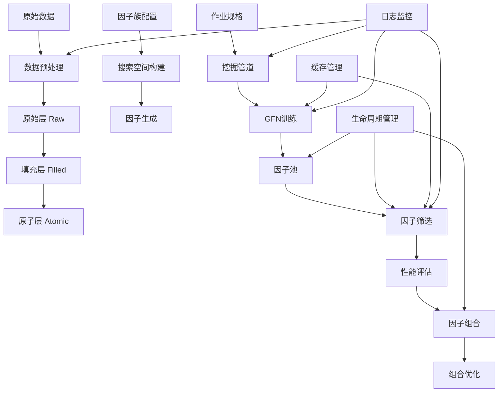

# My_Alpha_SAGE - 智能量化因子挖掘系统

## 项目概述

My_Alpha_SAGE是一个先进的量化因子挖掘系统，专为金融市场数据分析和alpha因子发现而设计。该系统采用多层数据架构、因子族配置驱动、作业规格化管理等现代化设计理念，支持从原始数据到因子组合的全流程自动化挖掘。

## 核心架构设计

### 1. 多层数据架构 (Multi-Layer Data Architecture)

系统采用三层数据架构设计，每层都有明确的数据职责和处理逻辑：

#### 原始层 (Raw Layer)

- **职责**：存储最原始的金融数据
- **数据特征**：包含缺失值、异常值，需要清洗
- **文件格式**：Parquet格式，支持高效列式存储
- **典型文件**：`feature_A_price_volume.parquet`

#### 填充层 (Filled Layer)

- **职责**：经过预处理和缺失值填充的数据
- **处理逻辑**：前向填充(30天限制) + 后向填充(15天限制) + 横截面中位数填充 + 全局0值回退
- **文件格式**：Parquet格式，保持与原始层相同的列结构
- **典型文件**：`feature_A_filled.parquet`

#### 原子层 (Atomic Layer)

- **职责**：基于原始/填充数据计算的基础衍生特征
- **特征类型**：收益率、波动率、偏离度、排序等基础计算
- **文件格式**：Parquet格式，包含标准化的原子特征
- **典型文件**：`feature_A_atomic.parquet`

### 2. 因子族配置系统 (Factor Family Configuration System)

采用YAML配置文件驱动的方式管理不同领域的因子定义：

### 核心配置文件

```yaml
# config/factor_families/pv_ts_core.yaml
family_id: pv_ts_core
name: "价格-成交量时序核心因子族"
description: "基于价格和成交量数据构建的时序因子"
enabled_layers: ["raw", "atomic"]
allowed_domains: ["A", "B", "C", "E"]
allowed_freq_groups: ["eod", "intraday"]

operator_whitelist:
  - Ref
  - TsMean
  - TsStd
  - TsRank
  - TsDelta
  
delta_times: [5, 10, 20, 40, 60]
constants: [0.5, 1.0, 2.0, 3.0, 5.0]
```

#### 因子族分类

1. **价格-成交量时序核心族 (pv_ts_core)**：基于价格和成交量的基础时序因子
2. **资金流因子族 (moneyflow)**：资金流向和成交明细相关因子
3. **筹码分布因子族 (chip)**：股东持股分布和筹码集中度因子
4. **日内交易因子族 (intraday)**：高频日内交易特征因子

### 3. 作业规格系统 (Job Specification System)

采用结构化的作业配置文件定义完整的挖掘任务：

#### 核心配置结构

```yaml
# config/jobs/a_share_pv_ts_2020_2021.yaml
job_id: a_share_pv_ts_2020_2021
name: "A股价格成交量时序因子挖掘-2020-2021"
dataset_id: cn.a_share.equity.daily.v1
family_id: pv_ts_core
segment_name: csi300

train_start: "20200101"
train_end: "20201231"
test_start: "20210101"
test_end: "20211231"

# 训练参数
n_episodes: 10000
pool_capacity: 50
encoder_type: gnn
entropy_coef: 0.01
ssl_weight: 1.0
nov_weight: 0.3

# 筛选参数
status_filter: ["active", "watch"]
max_backtrack_days: 100
max_future_days: 30
```

## 核心模块详解

### 1. 数据管理层 (Data Management Layer)

#### 1.1 DatasetMeta - 数据集元数据管理器

**文件位置**：`src/alphagen_generic/dataset_meta.py`

**核心功能**：

- 统一的数据集描述和验证
- 支持多层数据架构配置
- 向后兼容旧版本数据格式
- 提供数据请求验证机制

**关键属性**：

```python
class DatasetMeta:
    # 基础标识
    dataset_id: str          # 数据集唯一标识 (格式: region.market.asset_type.frequency.version)
    name: str               # 数据集名称
    frequency: str          # 数据频率 (daily/30min/5min/1min/weekly/monthly)
    domain: str             # 数据域 (A/B/C/E)
  
    # 扩展属性
    region: str             # 地区代码 (cn/us/hk/global)
    market: str             # 市场类型 (a_share/us_equity/futures/options)
    asset_type: str         # 资产类型 (equity/futures/options/crypto/fx)
    freq_group: str         # 频率组 (eod/intraday/weekly/monthly)
  
    # 数据层配置
    layers_enabled: List[str]    # 启用的数据层 ["raw", "filled", "atomic"]
    operator_whitelist: List[str] # 操作符白名单
```

**关键方法**：

- `validate()`: 验证元数据完整性和有效性
- `to_loader_kwargs()`: 转换为数据加载器参数
- `resolve_parquet_paths()`: 解析各层数据文件路径
- `validate_request()`: 验证数据请求参数

#### 1.2 ParquetFeatureLoaderV2 - 增强型特征加载器

**文件位置**：`src/alphagen_generic/parquet_feature_loader_v2.py`

**核心功能**：

- 支持多层数据视图加载
- 智能缓存机制，减少I/O开销
- 混合视图模式，动态选择最优数据层
- 批量数据处理和内存优化

**关键参数**：

```python
class ParquetFeatureLoaderV2:
    def __init__(
        self,
        dataset_id: str,                    # 数据集ID
        freq_group: str,                    # 频率组
        layers: List[str],                  # 启用的数据层
        feature_file_map_raw: Dict[str, str],     # 原始层文件映射
        feature_file_map_filled: Dict[str, str],  # 填充层文件映射
        atomic_path: Optional[str],               # 原子层路径
        cache_root: Optional[str],                # 缓存根目录
        return_close_only: bool = False,          # 是否只返回收盘价
    )
```

**关键特性**：

- **多层视图缓存**：为不同数据层组合创建缓存键
- **智能数据层选择**：根据数据完整性和性能自动选择最优层
- **样本池过滤**：支持动态股票池过滤
- **内存效率**：采用分块加载和内存映射技术

### 2. 特征注册管理层 (Feature Registry Management)

#### 2.1 FeatureRegistryManagerV2 - 特征注册管理器

**文件位置**：`src/alphagen_generic/feature_registry_manager_v2.py`

**核心功能**：

- 两层特征注册管理（原始层 + 原子层）
- 特征状态跟踪和生命周期管理
- 动态特征枚举生成
- 特征兼容性验证

**关键方法**：

```python
class FeatureRegistryManagerV2:
    def get_features_by_domain_and_layer(
        self, 
        domain: str, 
        layer: str, 
        status_filter: List[str]
    ) -> List[str]:
        """按域和层获取特征列表"""
      
    def create_feature_enum(
        self, 
        domain: str, 
        status_filter: List[str], 
        layers: List[str] = None
    ) -> IntEnum:
        """动态创建特征枚举，支持指定层"""
      
    def validate_feature_compatibility(
        self, 
        feature_name: str, 
        layer: str, 
        domain: str
    ) -> bool:
        """验证特征兼容性"""
```

#### 2.2 特征状态管理

系统定义了完整的特征生命周期状态：

- `active`: 活跃特征，可用于训练
- `watch`: 观察特征，性能待验证
- `deprecated`: 已弃用特征
- `experimental`: 实验性特征

### 3. 作业执行层 (Job Execution Layer)

#### 3.1 MiningJobSpec - 挖掘作业规格

**文件位置**：`src/mining/job_spec.py`

**核心功能**：

- 完整的作业参数定义和验证
- 支持参数映射到命令行参数
- 作业间依赖关系管理
- 参数继承和重写机制

**关键属性**：

```python
class MiningJobSpec:
    # 基础标识
    job_id: str                    # 作业唯一ID
    name: str                      # 作业名称
    dataset_id: str               # 关联数据集ID
    family_id: str               # 关联因子族ID
    segment_name: str             # 股票池段名称
  
    # 时间范围
    train_start: str             # 训练开始日期 (YYYYMMDD格式)
    train_end: str               # 训练结束日期
    test_start: str              # 测试开始日期
    test_end: str                # 测试结束日期
  
    # 训练参数
    n_episodes: int              # 训练轮数 (默认: 10000)
    pool_capacity: int          # 池容量 (默认: 50)
    encoder_type: str             # 编码器类型 (gnn/transformer/lstm)
    entropy_coef: float          # 熵系数 (默认: 0.01)
    ssl_weight: float            # SSL权重 (默认: 1.0)
    nov_weight: float            # 新颖性权重 (默认: 0.3)
  
    # 筛选参数
    status_filter: List[str]     # 状态筛选列表
    max_backtrack_days: int      # 最大回溯天数 (默认: 100)
    max_future_days: int         # 最大未来天数 (默认: 30)
```

#### 3.2 作业验证器 (JobSpecValidator)

**文件位置**：`src/mining/job_spec.py`

**验证规则**：

1. **数据集兼容性验证**：确保作业数据集与元数据匹配
2. **因子族兼容性验证**：验证因子族配置有效性
3. **时间范围验证**：检查训练/测试时间范围合理性
4. **参数有效性验证**：验证所有参数值在合理范围内

### 4. 因子构建层 (Factor Construction Layer)

#### 4.1 原子特征构建器 (Atomic Feature Builder)

**文件位置**：`src/data_prep/build_atomic_features.py`

**核心功能**：

- 基于配置驱动的原子特征生成
- 支持多域、多频率的原子特征计算
- 批处理和并行计算优化
- 特征统计和质量评估

**原子特征分类**：

```python
ATOMIC_FEATURES = {
    "momentum": {          # 动量类因子
        "ret_5": "5日收益率",
        "ret_10": "10日收益率", 
        "ret_20": "20日收益率",
        "ret_60": "60日收益率"
    },
    "volatility": {        # 波动率类因子
        "vol_5": "5日波动率",
        "vol_10": "10日波动率",
        "vol_20": "20日波动率",
        "vol_60": "60日波动率"
    },
    "deviation": {         # 偏离度类因子
        "deviation_5": "5日价格偏离度",
        "deviation_10": "10日价格偏离度",
        "deviation_20": "20日价格偏离度"
    },
    "rank": {              # 排序类因子
        "rank_volume_5": "5日成交量排序",
        "rank_amount_5": "5日成交额排序",
        "rank_ret_5": "5日收益率排序"
    }
}
```

#### 4.2 搜索空间构建器 (Search Space Builder)

**文件位置**：`src/mining/family_search_space.py`

**核心功能**：

- 基于因子族配置动态构建搜索空间
- 操作符白名单和黑名单机制
- 时间窗口参数管理
- 常数参数配置

**搜索空间组成**：

```python
# 操作符集合 (Operators)
operators = [Ref, TsMean, TsStd, TsRank, TsDelta, ...]

# 时间窗口 (Delta Times)
delta_times = [5, 10, 20, 40, 60]

# 常数参数 (Constants)  
constants = [0.5, 1.0, 2.0, 3.0, 5.0]
```

### 5. 挖掘执行层 (Mining Execution Layer)

#### 5.1 挖掘管道 (Mining Pipeline)

**文件位置**：`src/mining/mine_factors.py`

**核心功能**：

- 完整的挖掘流程 orchestration
- 多阶段状态管理和检查点
- 并行计算和资源管理
- 详细的日志记录和监控

**挖掘流程**：

```
1. 环境初始化
   ├── 数据集元数据加载
   ├── 因子族配置解析
   ├── 特征注册表初始化
   └── 数据加载器构建

2. 搜索空间构建
   ├── 操作符集合生成
   ├── 时间窗口参数配置
   ├── 常数参数设置
   └── 约束条件应用

3. GFN环境配置
   ├── 目标表达式构建
   ├── 特征枚举生成
   ├── 编码器初始化
   └── 奖励函数配置

4. 训练执行
   ├── 多轮次训练循环
   ├── 池更新和管理
   ├── 性能监控
   └── 检查点保存

5. 结果输出
   ├── 因子表达式保存
   ├── 性能指标统计
   ├── 可视化报告
   └── 元数据记录
```

#### 5.2 训练入口 (Training Entry Points)

**V1版本**：`src/train_gfn.py`

- 传统训练入口，向后兼容
- 支持命令行参数配置
- 简化的训练流程

**V2版本**：`src/train_gfn_v2.py`

- 新架构主训练入口
- 作业规格驱动配置
- 增强的缓存和性能优化
- 支持新特性：多层数据、因子族、生命周期管理

### 6. 因子筛选层 (Factor Screening Layer)

#### 6.1 独立筛选系统 (Independent Screening System)

**文件位置**：`src/mining/screen_factors.py`

**核心功能**：

- 多维度因子评估 (IC、ICIR、TopK、稳定性)
- 批量因子处理和高效计算
- 可配置的筛选标准和阈值
- 详细的筛选报告和统计

**评估指标体系**：

```python
# 主要指标 (Primary Metrics)
icir: float              # IC信息比率，衡量因子稳定性
topk_ret: float         # TopK组合收益率，衡量因子盈利能力  
stability: float        # 稳定性评分，衡量因子持续性

# 次要指标 (Secondary Metrics)
ic: float               # 信息系数，衡量预测能力
ret: float              # 收益率，衡量绝对表现
turnover: float         # 换手率，衡量交易成本
```

**筛选流程**：

```
1. 因子加载和预处理
   ├── 因子表达式解析
   ├── 数据加载和验证
   └── 缺失值处理

2. 指标计算
   ├── IC时间序列计算
   ├── TopK组合构建
   ├── 收益率统计
   └── 稳定性评估

3. 筛选判断
   ├── 阈值比较
   ├── 排名筛选
   ├── 相关性检验
   └── 显著性测试

4. 结果输出
   ├── 通过因子列表
   ├── 性能指标汇总
   ├── 可视化图表
   └── 详细报告
```

### 7. 组合优化层 (Portfolio Optimization Layer)

#### 7.1 自适应组合系统 (Adaptive Combination System)

**文件位置**：`src/run_adaptive_combination.py`

**核心功能**：

- 多因子自适应加权组合
- 滚动窗口和扩展窗口支持
- 多种回归求解器 (Ridge/LSTSQ)
- 多重共线性检测和处理

**组合策略**：

```python
# 滚动窗口策略 (Rolling Window)
window_size: int = 252      # 滚动窗口大小
window_type: str = "rolling"  # rolling/expanding

# 因子选择策略
selection_method: str = "icir_ranking"  # 基于ICIR排序选择
max_factors: int = 15                   # 最大因子数量
threshold_icir: float = 0.15            # ICIR阈值

# 回归求解器
solver: str = "ridge"         # ridge/lstsq
ridge_alpha: float = 1e-4    # Ridge正则化参数
```

#### 7.2 性能评估系统 (Performance Evaluation System)

**文件位置**：`src/alphagen_generic/adaptive_metrics.py`

**核心功能**：

- 多维度性能指标计算
- ICIR/TopK/Stability主指标体系
- 批量计算和内存优化
- 统计显著性检验

**性能指标体系**：

```python
# 主指标 (Primary Metrics) - 用于因子筛选
"icir": float                    # IC信息比率
"topk_ret": float              # TopK组合收益率  
"topk_retir": float            # TopK信息比率
"stability": float             # 稳定性评分

# 传统指标 (Legacy Metrics) - 用于兼容性
"ic": float                     # 信息系数
"ric": float                    # 秩信息系数
"ricir": float                  # 秩信息比率
"ret": float                    # 简单收益率
```

### 8. 缓存管理层 (Cache Management Layer)

#### 8.1 缓存管理器 (Cache Manager)

**文件位置**：`src/alpha_gfn/cache_manager.py`

**核心功能**：

- 表达式值缓存，避免重复计算
- 奖励值缓存，加速训练过程
- 内存和磁盘两级缓存
- 缓存统计和性能监控

**缓存键构建**：

```python
class CacheKeyBuilder:
    @staticmethod
    def expr_key(expr_str: str, data_hash: str) -> str:
        """表达式值缓存键：hash(expr_str + data_hash)"""
      
    @staticmethod  
    def reward_key(expr_str: str, pool_state_hash: str) -> str:
        """奖励缓存键：hash(reward:expr_str|pool:pool_state_hash)"""
      
    @staticmethod
    def data_hash(dates: pd.Index, stock_ids: pd.Index, domain: str) -> str:
        """数据指纹：基于日期范围、股票池、domain"""
```

#### 8.2 Alpha池增强版 (Alpha Pool V2)

**文件位置**：`src/alpha_gfn/alpha_pool_v2.py`

**增强特性**：

- 多种入池策略 (IC排序/多样性感知/自适应)
- 高级缓存集成，提升性能
- 详细的入池统计和监控
- 动态阈值调整和优化

**入池策略**：

```python
# IC排序策略 (IC Ranking)
entry_strategy: str = "ic_ranking"
min_ic_threshold: float = 0.05

# 多样性感知策略 (Diversity Aware)  
entry_strategy: str = "diversity_aware"
diversity_weight: float = 0.3
max_similarity_threshold: float = 0.95

# 自适应策略 (Adaptive)
entry_strategy: str = "adaptive"
adaptive_threshold_decay: float = 0.99
```

### 9. 生命周期管理层 (Lifecycle Management Layer)

#### 9.1 因子生命周期管理器 (Factor Lifecycle Manager)

**文件位置**：`src/mining/factor_registry.py`

**核心功能**：

- 完整的因子生命周期跟踪
- 状态转换和历史记录
- 自动化清理和维护
- 统计分析和报告生成

**生命周期状态**：

```python
class FactorStatus(Enum):
    CREATED = "created"          # 刚创建
    EVALUATED = "evaluated"      # 已评估  
    SCREENED = "screened"        # 已筛选
    COMBINED = "combined"        # 已组合
    ARCHIVED = "archived"        # 已归档
    REJECTED = "rejected"        # 被拒绝
```

**生命周期流程**：

```
创建(CREATED) → 评估(EVALUATED) → 筛选(SCREENED) → 组合(COMBINED)
                    ↓
                拒绝(REJECTED) / 归档(ARCHIVED)
```

#### 9.2 清单生成器 (Manifest Generator)

自动生成项目运行清单，包含：

- 处理时间戳和版本信息
- 各阶段统计摘要
- 因子状态分布
- 性能指标汇总

### 10. 预处理增强层 (Preprocessing Enhancement Layer)

#### 10.1 参数化预处理系统 (Parameterized Preprocessing)

**文件位置**：`src/preprocess_features_v2.py`

**核心功能**：

- YAML配置文件驱动
- 灵活的填充策略配置
- 批量处理和性能优化
- 详细的预处理统计

**配置参数**：

```yaml
# 填充配置
filling_config:
  ffill_limit: 30          # 前向填充限制
  bfill_limit: 15        # 后向填充限制
  cross_sectional_fill: true   # 横截面填充开关
  global_fallback: 0.0     # 全局回退值

# 质量控制
quality_checks:
  max_nan_rate: 0.5      # 最大缺失率
  min_observations: 100  # 最小观测数
```

**预处理流程**：

```
1. 数据加载
   ├── Parquet文件读取
   ├── 数据类型推断
   └── 列结构验证

2. 时间序列填充
   ├── 按股票分组
   ├── 前向填充(有限制)
   └── 后向填充(有限制)

3. 横截面填充
   ├── 按日期分组
   ├── 中位数计算
   └── 缺失值填充

4. 全局回退
   └── 最终0值填充

5. 质量检查
   ├── 缺失率检查
   ├── 观测数验证
   └── 异常值检测

6. 结果输出
   ├── Parquet文件保存
   ├── 预处理统计生成
   └── 清单文件更新
```

## 系统流程架构

### 完整数据流程



### 核心处理流程

#### 1. 数据准备流程

```
原始金融数据
    ↓
参数化预处理(preprocess_features_v2.py)
    ├── 时间序列填充(ffill=30, bfill=15)
    ├── 横截面中位数填充
    └── 全局0值回退
    ↓
多层数据架构
    ├── 原始层(Raw): 原始数据保存
    ├── 填充层(Filled): 清洗后数据
    └── 原子层(Atomic): 基础衍生特征
```

#### 2. 因子挖掘流程

```
因子族配置(YAML)
    ↓
搜索空间构建(family_search_space.py)
    ├── 操作符集合生成
    ├── 时间窗口配置
    └── 常数参数设置
    ↓
作业规格定义(job_spec.py)
    ├── 数据集绑定
    ├── 时间范围设置
    └── 训练参数配置
    ↓
挖掘执行(mine_factors.py)
    ├── 环境初始化
    ├── GFN训练循环
    ├── 因子池管理
    └── 结果输出
```

#### 3. 因子评估流程

```
生成的因子表达式
    ↓
独立筛选系统(screen_factors.py)
    ├── IC时间序列计算
    ├── TopK组合构建
    ├── 稳定性评估
    └── 多维度筛选
    ↓
性能评估(adaptive_metrics.py)
    ├── ICIR计算
    ├── TopK收益率统计
    └── 稳定性评分
    ↓
因子组合优化(run_adaptive_combination.py)
    ├── 自适应加权
    ├── 滚动窗口优化
    └── 组合性能评估
```

## 接口设计规范

### 1. 数据接口规范

#### DatasetMeta接口

```python
# 构造接口
DatasetMeta(meta_source: str | Dict[str, Any])
# 支持文件路径或字典直接构造

# 核心方法
to_loader_kwargs() -> Dict[str, Any]    # 转换为加载器参数
validate_request(start, end, freq, layer) -> List[str]  # 请求验证
resolve_parquet_paths() -> Dict[str, str]              # 路径解析
```

#### ParquetFeatureLoaderV2接口

```python
# 构造参数
dataset_id: str              # 数据集ID
freq_group: str             # 频率组
layers: List[str]           # 启用的数据层
cache_root: Optional[str]   # 缓存根目录
return_close_only: bool     # 仅返回收盘价

# 核心方法
load() -> Tuple[pd.DataFrame, pd.DataFrame]  # 加载数据
clear_cache() -> None                        # 清理缓存
get_cache_stats() -> Dict[str, int]         # 缓存统计
```

### 2. 特征注册接口规范

#### FeatureRegistryManagerV2接口

```python
# 特征查询
get_features_by_domain_and_layer(domain, layer, status_filter) -> List[str]
get_feature_info(feature_name, layer) -> Dict[str, Any]

# 枚举生成
create_feature_enum(domain, status_filter, layers) -> IntEnum
create_feature_enum_by_layer(domain, layer, status_filter) -> IntEnum

# 状态管理
update_feature_status(feature_name, layer, domain, status) -> bool
validate_feature_compatibility(feature_name, layer, domain) -> bool
```

### 3. 作业管理接口规范

#### MiningJobSpec接口

```python
# 属性访问 (新增完整属性支持)
@property
def status_filter(self) -> List[str]: ...
@property  
def max_backtrack_days(self) -> int: ...
@property
def max_future_days(self) -> int: ...
@property
def n_episodes(self) -> int: ...
@property
def pool_capacity(self) -> int: ...

# 验证和转换
validate() -> List[str]      # 验证作业规格
to_dict() -> Dict[str, Any]  # 转换为字典
to_args() -> Dict[str, Any]  # 转换为命令行参数
```

#### JobSpecValidator接口

```python
# 兼容性验证
validate_compatibility(job_spec, dataset_meta, family_spec) -> List[str]

# 验证内容
# - 数据集ID一致性
# - 因子族ID一致性  
# - 域兼容性
# - 时间范围合理性
```

### 4. 挖掘执行接口规范

#### 挖掘管道接口

```python
# 主执行函数
mine_factors(job_spec_path: str, log_dir: Optional[str]) -> Dict[str, Any]

# 上下文构建
build_mining_context(job_spec_path: str) -> MiningContext

# 环境配置
setup_gfn_environment(context: MiningContext) -> GFNEnvConfig
```

#### 训练入口接口

```python
# V1版本 (向后兼容)
train_traditional(args: argparse.Namespace) -> None

# V2版本 (新架构)
train_with_job_spec(job_ctx: Dict[str, Any]) -> None

# 上下文构建
build_job_context(args: argparse.Namespace) -> Dict[str, Any]
```

### 5. 筛选评估接口规范

#### 筛选系统接口

```python
# 主筛选函数
screen_factors(
    expressions: List[str],           # 因子表达式列表
    dataset_meta: DatasetMeta,       # 数据集元数据
    screening_config: Dict[str, Any] # 筛选配置
) -> ScreeningResults

# 评估函数
evaluate_ic(factor_values, target_values) -> Tuple[float, np.ndarray]
evaluate_topk_performance(factor_values, returns, k_ratio) -> Dict[str, float]
evaluate_stability(ic_series, window) -> float
```

#### 性能指标接口

```python
# 主指标计算
get_tensor_metrics_safe(x, y, y_ret, args) -> Tuple[Dict, np.ndarray]

# 新增指标
compute_topk_returns(x, y_ret, k_ratio) -> torch.Tensor
compute_stability_score(ic_s, window) -> float

# 指标内容
{
    "icir": float,              # IC信息比率 (主指标)
    "topk_ret": float,          # TopK收益率 (主指标)
    "topk_retir": float,        # TopK信息比率 (主指标)  
    "stability": float,         # 稳定性评分 (主指标)
    "ic": float,                # 信息系数 (传统指标)
    "ric": float,               # 秩信息系数 (传统指标)
}
```

### 6. 缓存管理接口规范

#### CacheManager接口

```python
# 构造接口
CacheManager(
    base_cache_dir: str,        # 缓存根目录
    domain: str,               # 数据域
    date_range: Tuple[str, str], # 日期范围
    config_hash: str,          # 配置哈希
    max_memory_items: int = 5000  # 内存缓存限制
)

# 核心方法
get(key: str) -> Optional[torch.Tensor]     # 获取缓存
put(key: str, value: torch.Tensor) -> None  # 存储缓存
clear() -> None                              # 清理缓存
get_stats() -> Dict[str, Any]               # 缓存统计
```

#### CacheKeyBuilder接口

```python
# 静态方法
@staticmethod
def expr_key(expr_str: str, data_hash: str) -> str: ...
@staticmethod  
def reward_key(expr_str: str, pool_state_hash: str) -> str: ...
@staticmethod
def data_hash(dates: pd.Index, stock_ids: pd.Index, domain: str) -> str: ...
```

## 数据架构设计

### 1. 数据层次结构

```
数据根目录/
├── data/
│   ├── factor_ready/           # 原始特征数据
│   │   ├── feature_A_price_volume.parquet
│   │   ├── feature_B_moneyflow.parquet
│   │   ├── feature_C_chip.parquet
│   │   └── feature_E_intraday_summary.parquet
│   │
│   ├── factor_ready_filled/    # 填充后特征数据
│   │   ├── feature_A_filled.parquet
│   │   ├── feature_B_filled.parquet
│   │   ├── feature_C_filled.parquet
│   │   └── feature_E_filled.parquet
│   │
│   ├── atomic_features/        # 原子特征数据
│   │   ├── feature_A_atomic.parquet
│   │   ├── feature_B_atomic.parquet
│   │   ├── feature_C_atomic.parquet
│   │   └── feature_E_atomic.parquet
│   │
│   ├── basic/                  # 基础市场数据
│   │   └── daily.parquet
│   │
│   ├── cache/                  # 缓存数据
│   │   └── {domain}/{date_range}/{config_hash}/
│   │       ├── expr_values/
│   │       └── reward_values/
│   │
│   └── registry/               # 特征注册表
│       ├── feature_registry_raw.csv
│       └── feature_registry_atomic.csv
│
├── config/                     # 配置文件
│   ├── datasets/               # 数据集配置
│   │   └── a_share_daily.yaml
│   │
│   ├── factor_families/        # 因子族配置
│   │   ├── pv_ts_core.yaml
│   │   ├── moneyflow.yaml
│   │   ├── chip.yaml
│   │   └── intraday.yaml
│   │
│   ├── jobs/                   # 作业配置
│   │   ├── a_share_pv_ts_2020_2021.yaml
│   │   └── futures_chip_2021_2022.yaml
│   │
│   ├── screening/              # 筛选配置
│   │   └── default_config.yaml
│   │
│   └── preprocessing/          # 预处理配置
│       └── default.yaml
│
├── output/                     # 输出目录
│   ├── mining_logs/            # 挖掘日志
│   │   └── {job_id}_{timestamp}/
│   │       ├── factors.json
│   │       ├── metrics.csv
│   │       └── plots/
│   │
│   ├── screening_results/      # 筛选结果
│   │   └── {screening_id}/
│   │       ├── screened_factors.json
│   │       └── performance_report.html
│   │
│   └── combination_results/    # 组合结果
│       └── {combination_id}/
│           ├── combined_factors.json
│           ├── metrics.csv
│           └── cumulative_returns.png
│
└── src/                        # 源代码
    ├── alphagen_generic/       # 通用组件
    ├── mining/                 # 挖掘相关
    ├── alpha_gfn/             # GFN核心
    ├── data_prep/             # 数据准备
    └── utils/                 # 工具函数
```

### 2. 配置文件结构

#### 数据集配置 (Dataset Configuration)

```yaml
# config/datasets/a_share_daily.yaml
dataset_id: cn.a_share.equity.daily.v1
name: "A股日频数据集"
description: "包含价格、成交量、财务等基础数据的A股日频数据集"

frequency: daily
domain: A
region: cn
market: a_share
asset_type: equity
freq_group: eod

data_dir: data/factor_ready
files:
  raw: feature_A_price_volume.parquet
  filled: feature_A_filled.parquet
  atomic: feature_A_atomic.parquet

columns:
  date: trade_date
  code: ts_code
  close: close
  
date_range:
  start: "20200101"
  end: "20231231"
  
operator_whitelist:
  - Ref
  - TsMean
  - TsStd
  - TsRank
  
max_ast_depth: 12
recommended_delta_times: [5, 10, 20, 40, 60]
recommended_constants: [0.5, 1.0, 2.0, 3.0, 5.0]
```

#### 因子族配置 (Factor Family Configuration)

```yaml
# config/factor_families/pv_ts_core.yaml
family_id: pv_ts_core
name: "价格-成交量时序核心因子族"
description: "基于价格和成交量数据构建的时序因子族，包含动量、均值回归等基础特征"

enabled_layers: ["raw", "atomic"]
allowed_domains: ["A", "B", "C", "E"]
allowed_freq_groups: ["eod", "intraday"]

# 操作符配置
operator_whitelist:
  - Ref
  - TsMean
  - TsStd
  - TsRank
  - TsDelta
  - Add
  - Sub
  - Mul
  - Div
  - Rank

forbid_operators:
  - Greater
  - Less
  - Pow

delta_times: [5, 10, 20, 40, 60]
constants: [0.5, 1.0, 2.0, 3.0, 5.0]

# 特征约束
max_expr_length: 20
min_ts_operator_count: 2
sample_budget: 1000000
```

#### 作业配置 (Job Configuration)

```yaml
# config/jobs/a_share_pv_ts_2020_2021.yaml
job_id: a_share_pv_ts_2020_2021
name: "A股价格成交量时序因子挖掘-2020-2021"
description: "基于A股价格成交量数据，使用GFN挖掘时序因子的完整作业"

dataset_id: cn.a_share.equity.daily.v1
family_id: pv_ts_core
segment_name: csi300

# 时间范围
train_start: "20200101"
train_end: "20201231"
test_start: "20210101"
test_end: "20211231"

# 训练参数
n_episodes: 10000
pool_capacity: 50
encoder_type: gnn
entropy_coef: 0.01
ssl_weight: 1.0
nov_weight: 0.3
weight_decay_type: linear
final_weight_ratio: 0.0

# 模型参数
label_days: 10
max_expr_length: 20
mask_dropout_prob: 1.0

# 筛选参数
status_filter: ["active", "watch"]
max_backtrack_days: 100
max_future_days: 30

# 输出配置
cache_root: data/cache
output_dir: output/mining_results
run_name: a_share_pv_ts_2020_2021_run001

# 系统参数
seed: 42
cuda: 0
log_freq: 1000
```

### 3. 输出数据结构

#### 因子输出格式

```json
{
  "job_id": "a_share_pv_ts_2020_2021",
  "run_name": "a_share_pv_ts_2020_2021_run001",
  "timestamp": "2024-01-15T10:30:00Z",
  "factors": [
    {
      "rank": 1,
      "expression": "TsMean(Ref(close, 5), 20)",
      "weight": 0.15,
      "metrics": {
        "ic": 0.052,
        "icir": 0.78,
        "ret": 0.0012,
        "turnover": 0.23
      }
    }
  ],
  "summary": {
    "total_factors": 50,
    "avg_ic": 0.045,
    "avg_icir": 0.65,
    "best_factor_ic": 0.078
  }
}
```

#### 性能评估报告

```json
{
  "screening_id": "screen_20240115_103000",
  "timestamp": "2024-01-15T10:30:00Z",
  "config": {
    "icir_threshold": 0.15,
    "topk_threshold": 0.001,
    "stability_threshold": 0.5
  },
  "results": {
    "total_factors": 1000,
    "passed_factors": 156,
    "pass_rate": 0.156,
    "best_factor": {
      "expression": "TsRank(TsMean(volume, 10), 20)",
      "icir": 0.82,
      "topk_ret": 0.0023,
      "stability": 2.1
    }
  },
  "statistics": {
    "icir_distribution": {"mean": 0.23, "std": 0.18},
    "topk_ret_distribution": {"mean": 0.0008, "std": 0.0012},
    "stability_distribution": {"mean": 1.2, "std": 0.8}
  }
}
```

## 系统特性与优势

### 1. 架构优势

#### 1.1 模块化设计

- **高内聚低耦合**：各模块职责清晰，依赖关系明确
- **插件化扩展**：支持新数据源、新因子族、新算法的无缝集成
- **配置驱动**：通过YAML配置文件灵活调整系统行为
- **接口标准化**：统一的API设计，便于系统集成和维护

#### 1.2 多层数据架构

- **数据质量保障**：通过分层处理确保数据质量和一致性
- **处理效率优化**：缓存机制和智能数据层选择提升性能
- **存储空间优化**：避免数据重复存储，节省存储空间
- **处理流程可追溯**：每层数据都有明确的处理历史和版本

#### 1.3 因子族配置系统

- **领域专业化**：针对不同金融市场特征设计专门的因子族
- **参数标准化**：统一的参数配置格式，便于管理和维护
- **可扩展性强**：支持新因子族的快速添加和配置
- **复用性高**：因子族配置可在不同作业间共享和复用

### 2. 性能优势

#### 2.1 计算效率

- **向量化计算**：大量使用Pandas和NumPy向量化操作
- **批处理优化**：支持大批量因子并行计算
- **内存管理**：智能内存使用和垃圾回收优化
- **缓存机制**：多层级缓存减少重复计算

#### 2.2 I/O优化

- **Parquet格式**：列式存储，支持高效数据读取
- **分块处理**：大文件分块读取，降低内存峰值
- **缓存策略**：数据视图缓存，避免重复I/O操作
- **异步加载**：支持数据的异步加载和预处理

#### 2.3 并行处理

- **多进程支持**：CPU密集型任务支持多进程并行
- **GPU加速**：关键计算支持GPU加速
- **分布式潜力**：架构设计支持未来分布式扩展

### 3. 质量保障

#### 3.1 数据质量控制

- **完整性检查**：多层数据完整性验证机制
- **一致性验证**：跨数据源一致性检查
- **异常值处理**：完善的异常值检测和处理流程
- **质量指标**：详细的数据质量指标和报告

#### 3.2 模型验证机制

- **时间序列交叉验证**：避免未来信息泄露
- **多维度评估**：IC、ICIR、TopK、稳定性等多指标评估
- **统计显著性检验**：提供统计显著性验证
- **稳健性测试**：支持参数扰动下的稳健性验证

#### 3.3 系统可靠性

- **错误处理机制**：完善的异常捕获和处理
- **检查点机制**：支持训练过程的中断和恢复
- **日志记录**：详细的运行日志和错误追踪
- **监控告警**：关键指标监控和异常告警

### 4. 易用性优势

#### 4.1 配置驱动

- **YAML配置文件**：人类可读的配置格式
- **参数验证**：配置参数的类型和范围验证
- **默认值机制**：合理的默认参数设置
- **配置继承**：支持配置的继承和重写

#### 4.2 接口友好

- **统一API设计**：一致的接口设计风格
- **详细文档**：完整的API文档和使用示例
- **错误提示**：清晰的错误信息和解决建议
- **向后兼容**：版本升级保持接口兼容性

#### 4.3 可视化支持

- **性能图表**：自动生成性能评估图表
- **因子分析报告**：详细的因子分析HTML报告
- **进度可视化**：训练过程的可视化展示
- **结果汇总**：清晰的结果汇总和对比

## 系统部署与运维

### 1. 环境要求

#### 1.1 硬件要求

- **CPU**：多核处理器，建议8核以上
- **内存**：最少16GB，推荐32GB以上
- **存储**：SSD存储，至少100GB可用空间
- **GPU**：可选，NVIDIA GPU支持CUDA加速

#### 1.2 软件依赖

```python
# 核心依赖
pandas >= 1.3.0      # 数据处理
numpy >= 1.21.0      # 数值计算  
pytorch >= 1.9.0     # 深度学习
pyarrow >= 5.0.0     # 高效数据格式
scikit-learn >= 1.0.0 # 机器学习

# 配置和工具
pyyaml >= 5.4.0      # YAML配置解析
tqdm >= 4.62.0       # 进度条显示
matplotlib >= 3.4.0  # 图表绘制
seaborn >= 0.11.0    # 统计可视化
```

### 2. 部署流程

#### 2.1 环境准备

```bash
# 1. 创建Python虚拟环境
python -m venv My_Alpha_SAGE_env
source My_Alpha_SAGE_env/bin/activate  # Linux/Mac
# 或
My_Alpha_SAGE_env\Scripts\activate     # Windows

# 2. 安装依赖
pip install -r requirements.txt

# 3. 配置环境变量
export My_Alpha_SAGE_ROOT=/path/to/My_Alpha_SAGE
export My_Alpha_SAGE_DATA_DIR=/path/to/data
export My_Alpha_SAGE_CONFIG_DIR=/path/to/config
```

#### 2.2 数据准备

```bash
# 1. 准备原始数据
mkdir -p data/factor_ready
cp your_raw_data.parquet data/factor_ready/

# 2. 创建数据集配置
cp config/templates/dataset_template.yaml config/datasets/your_dataset.yaml
# 编辑配置文件

# 3. 运行预处理
python src/preprocess_features_v2.py --config config/preprocessing/default.yaml
```

#### 2.3 系统初始化

```bash
# 1. 创建因子族配置
# 编辑 config/factor_families/your_family.yaml

# 2. 创建作业配置  
# 编辑 config/jobs/your_job.yaml

# 3. 验证配置
python -c "
from src.mining.job_spec import load_job_spec
spec = load_job_spec('config/jobs/your_job.yaml')
print('Job spec validated:', spec.validate())
"
```

### 3. 运行模式

#### 3.1 单作业模式

```bash
# 运行单个挖掘作业
python src/train_gfn_v2.py --job_spec config/jobs/your_job.yaml

# 运行因子筛选
python src/mining/screen_factors.py --job_spec config/jobs/your_job.yaml

# 运行因子组合
python src/run_adaptive_combination.py --expressions_file your_factors.json
```

#### 3.2 批量模式

```bash
# 批量运行多个作业
for job_file in config/jobs/*.yaml; do
    echo "Running $job_file"
    python src/train_gfn_v2.py --job_spec "$job_file"
done
```

#### 3.3 服务模式

```python
# 可以包装为API服务
from src.mining.mine_factors import mine_factors
from src.mining.screen_factors import screen_factors

class My_Alpha_SAGEService:
    def submit_mining_job(self, job_config: dict) -> str:
        """提交挖掘作业"""
      
    def get_job_status(self, job_id: str) -> dict:
        """获取作业状态"""
      
    def get_screening_results(self, screening_id: str) -> dict:
        """获取筛选结果"""
```

### 4. 监控与维护

#### 4.1 系统监控

- **资源监控**：CPU、内存、磁盘使用率
- **性能监控**：处理速度、缓存命中率、I/O性能
- **质量监控**：数据质量指标、因子性能指标
- **错误监控**：异常频率、错误类型统计

#### 4.2 日常维护

- **日志清理**：定期清理过期日志文件
- **缓存维护**：清理过期缓存，优化缓存策略
- **数据备份**：重要配置和结果数据备份
- **性能优化**：基于监控数据调整系统参数

#### 4.3 故障处理

- **配置错误**：检查YAML配置文件格式和内容
- **数据问题**：验证数据文件完整性和格式
- **资源不足**：监控系统资源使用情况
- **性能下降**：分析性能瓶颈，优化相关参数

## 系统扩展性

### 1. 数据源扩展

#### 1.1 新增数据域

```python
# 1. 创建新的数据集配置
# config/datasets/new_domain.yaml

dataset_id: us.equity.daily.v1
domain: US
region: us
market: us_equity

# 2. 扩展DatasetMeta支持
class DatasetMeta:
    VALID_DOMAINS = ["A", "B", "C", "E", "US"]  # 添加新域
  
# 3. 更新相关验证逻辑
```

#### 1.2 新频率支持

```python
# 扩展频率支持
class DatasetMeta:
    VALID_FREQUENCIES = ["daily", "30min", "5min", "1min", "weekly", "monthly"]
    VALID_FREQ_GROUPS = ["eod", "intraday", "weekly", "monthly"]
```

### 2. 因子族扩展

#### 2.1 新因子族类型

```yaml
# config/factor_families/new_family.yaml
family_id: new_family
description: "新的因子族类型"

enabled_layers: ["raw", "atomic"]
allowed_domains: ["A", "B", "C", "E", "US"]
allowed_freq_groups: ["eod", "intraday", "weekly"]

# 定义新的操作符集合
operator_whitelist:
  - NewOperator1
  - NewOperator2
  
# 定义新的参数范围
delta_times: [1, 2, 3, 5, 10, 20]
constants: [0.1, 0.2, 0.5, 1.0, 2.0]
```

#### 2.2 原子特征扩展

```python
# src/data_prep/build_atomic_features.py
ATOMIC_FEATURES = {
    # 现有特征...
    "new_category": {
        "new_feature1": "新特征1描述",
        "new_feature2": "新特征2描述",
    }
}

def _compute_atomic_feature(self, feature_name: str, data: pd.DataFrame) -> pd.Series:
    if feature_name.startswith("new_"):
        # 实现新的原子特征计算逻辑
        pass
```

### 3. 算法扩展

#### 3.1 新挖掘算法

```python
# src/alpha_gfn/new_miner.py
class NewFactorMiner:
    def __init__(self, config: dict):
        self.config = config
      
    def mine_factors(self, data: pd.DataFrame, target: pd.Series) -> List[Factor]:
        """实现新的因子挖掘算法"""
        pass
      
    def evaluate_factor(self, factor: Factor, data: pd.DataFrame) -> dict:
        """评估因子性能"""
        pass
```

#### 3.2 新评估指标

```python
# src/alphagen_generic/adaptive_metrics.py
def compute_new_metric(factor_values, target_values, **kwargs) -> float:
    """计算新的评估指标"""
    pass
  
def get_extended_metrics(x, y, y_ret, args) -> dict:
    """扩展的指标计算"""
    metrics = get_tensor_metrics_safe(x, y, y_ret, args)
    metrics["new_metric"] = compute_new_metric(x, y)
    return metrics
```

### 4. 部署扩展

#### 4.1 分布式部署

```python
# 分布式数据加载
class DistributedParquetLoader:
    def __init__(self, data_sources: List[str], cluster_config: dict):
        self.cluster = self._setup_cluster(cluster_config)
      
    def load_distributed(self, query: dict) -> pd.DataFrame:
        """分布式数据加载"""
        pass
```

#### 4.2 云原生部署

```yaml
# kubernetes deployment
apiVersion: apps/v1
kind: Deployment
metadata:
  name: My_Alpha_SAGE-worker
spec:
  replicas: 3
  selector:
    matchLabels:
      app: My_Alpha_SAGE-worker
  template:
    metadata:
      labels:
        app: My_Alpha_SAGE-worker
    spec:
      containers:
      - name: My_Alpha_SAGE
        image: My_Alpha_SAGE:latest
        env:
        - name: My_Alpha_SAGE_MODE
          value: "worker"
        resources:
          requests:
            memory: "8Gi"
            cpu: "4"
          limits:
            memory: "16Gi" 
            cpu: "8"
```

## 总结与展望

### 系统价值总结

My_Alpha_SAGE系统通过其创新的多层数据架构、配置驱动的因子族管理、作业规格化的流程控制，以及完整的生命周期管理，为量化因子挖掘提供了一个功能完备、性能优异、易于扩展的解决方案。

#### 核心创新点：

1. **多层数据架构**：首次在量化因子挖掘领域引入raw/filled/atomic三层数据架构，解决了数据质量与处理效率的平衡问题
2. **因子族配置系统**：通过YAML配置文件实现因子挖掘的领域专业化，支持不同市场的特色化因子发现
3. **作业规格化管理**：将完整的挖掘流程规格化，支持参数化、可重现的因子挖掘实验
4. **ICIR/TopK/Stability主指标体系**：建立了更加科学合理的因子评估体系，提高了因子筛选的有效性

#### 技术优势：

1. **高性能计算**：通过向量化、批处理、缓存优化等技术，实现了大规模因子挖掘的高效处理
2. **模块化架构**：清晰的模块划分和标准化的接口设计，保证了系统的可维护性和可扩展性
3. **配置驱动**：灵活的配置机制使得系统能够适应不同的应用场景和业务需求
4. **质量保障**：完善的数据质量控制、模型验证和系统监控机制，确保了系统的可靠性

### 应用价值

#### 对量化研究的价值：

1. **提升研究效率**：自动化的因子挖掘流程大大减少了人工参与，提高了因子发现效率
2. **保证研究质量**：标准化的评估体系和验证机制，确保了因子研究的质量和可靠性
3. **促进知识积累**：完整的生命周期管理和清单生成，有利于因子研究成果的积累和复用
4. **支持创新探索**：灵活的配置和扩展机制，为因子创新提供了强有力的工具支持

#### 对投资实践的价值：

1. **发现有效因子**：通过系统化的挖掘流程，能够发现传统方法难以发现的隐含因子
2. **优化因子组合**：科学的评估体系和组合优化方法，能够构建更加有效的因子组合
3. **控制投资风险**：多维度评估和稳健性检验，有助于控制因子投资的风险
4. **提升投资绩效**：高质量的因子发现和组合构建，为提升投资绩效奠定了基础

### 未来发展方向

#### 技术发展方向：

1. **人工智能深度融合**：进一步整合深度学习、强化学习等AI技术，提升因子发现的智能化水平
2. **多模态数据融合**：扩展对文本、图像、语音等多模态金融数据的处理能力
3. **实时因子挖掘**：支持流式数据的实时因子挖掘和动态更新
4. **联邦学习支持**：在保护数据隐私的前提下，支持跨机构的协同因子挖掘

#### 应用发展方向：

1. **跨市场扩展**：从A股市场扩展到港股、美股、期货、外汇等更多市场
2. **多资产类别**：支持股票、债券、商品、加密货币等多种资产类别的因子挖掘
3. **ESG因子挖掘**：专门的环境、社会、治理因子挖掘和分析
4. **宏观经济因子**：构建宏观经济指标与资产价格的关联因子

#### 生态发展方向：

1. **开源社区建设**：建立活跃的开源社区，促进技术交流和创新
2. **标准化推进**：推动量化因子挖掘的标准化和规范化
3. **教育培训**：开展相关的教育培训，培养专业人才
4. **产学研合作**：加强与高校、研究机构的合作，推动技术创新

### 结语

My_Alpha_SAGE系统代表了量化因子挖掘技术的重要进步，它不仅提供了一个功能强大的技术平台，更重要的是建立了一套科学、系统、可扩展的因子挖掘方法论。随着金融科技的不断发展和量化投资的日益普及，我们相信这样的系统化工具将在未来的金融市场中发挥越来越重要的作用，为投资者创造更大的价值，推动整个行业的技术进步。

通过持续的技术创新和实践优化，My_Alpha_SAGE有望成为量化因子挖掘领域的标杆性工具，为量化投资的发展贡献重要力量。我们期待着与更多的研究者、投资者和技术人员一起，共同推动这一领域的发展，探索金融市场的更多奥秘。
